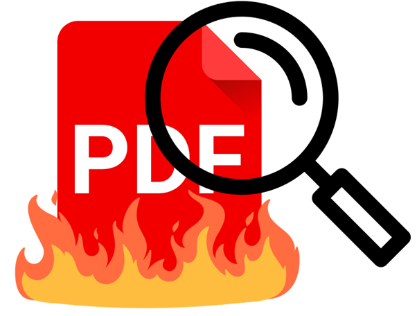

# Concept-Definer-Agent

Google adk agent that defines concepts found in PDF files. Made for Kaggle's "5 days of AI" Capstone Project

## How does it work?

Upon receiving a query stating **what concept to find** and **in which PDF to do so**, the agent will extract all text in the PDF and will state either the definition of the concept as it is stated in the text if it ever is, or a paraphrasing of the definition, only if it's alluded to in the text and not outright stated.

If the concept does not appear in the file, the agent should tell you so.

## Why this agent?

Hallucinating is common on agents as the context or their task grows in complexity. If an agent handles concept extraction and other things, it's prone to make up the definitions or use others that are not relevant to the situation. Altough this agent has some uses by its own, it's focused on reducing other agent's load via a2a communication.

## Authors

This agent was made by Tomás A. Romanutti & Jazmín Caruso Rojo.
